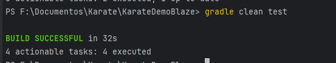

# Karate Basic Exercise with DemoBlaze
Ejercicio basico de Pruebas de API de Registro y Acceso al Sistema de DemoBlaze con Karate

# Descripción

El proyecto incluye pruebas para los siguientes endpoints de la API:

	/signUp
	Caso 1: REGISTRAR un nuevo CLIENTE EXITOSAMENTE
	Caso 2: Intentar REGISTRAR un CLIENTE EXISTENTE
	/login
	Caso 1: LOGIN de un Cliente exitosamente con CREDENCIALES CORRECTAS
	Caso 2: Intentar LOGIN de un Cliente con USERNAME que no EXISTE
	Caso 3: Intentar LOGIN de un Cliente con CONTRASEÑA INCORRECTA

# Estructura Basica del Proyecto

	+ main
		+ build
			+ ...
			+ ...
			+ reports/tests/test/index.html
			
		+ src
			+ test
				+ java
					+ examples
						+ data
							Datos en JS y JSON para APIs
						+ features
							+ login
								login.feature
								LoginRunner 
							+ signUp
								signUp.feature
								SignUpRunner
						ExamplesTest.java
					karate-config.js
						

# Requisitos Previos

	- JDK v17.0.9
	- Gradle v7.6.0
	- IntellIj (Ultima versión recomendado)

# Instalación y Ejecución de las pruebas sobre el arquetipo de Karate

1) Clonar el repositorio

	- git clone https://github.com/DavidAlejo24/KarateDemoBlaze.git

2) Navegar hacia el repositorio clonado

	- cd KarateDemoBlaze

3) Ejecutar las pruebas

	- gradle clean test
	
	
# Ruta informe
El informe se crea en la ruta:
	- main/build/reports/tests/test

Puede visualizarlo mediante el archivo
	- index.html

# Resultados de las pruebas 

Ejecución Exitosa

Reporte generado

	

